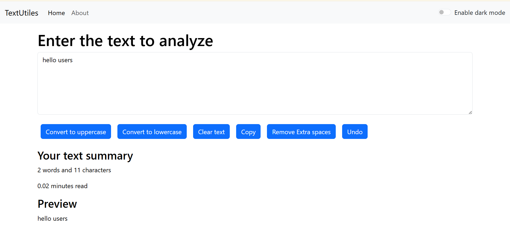
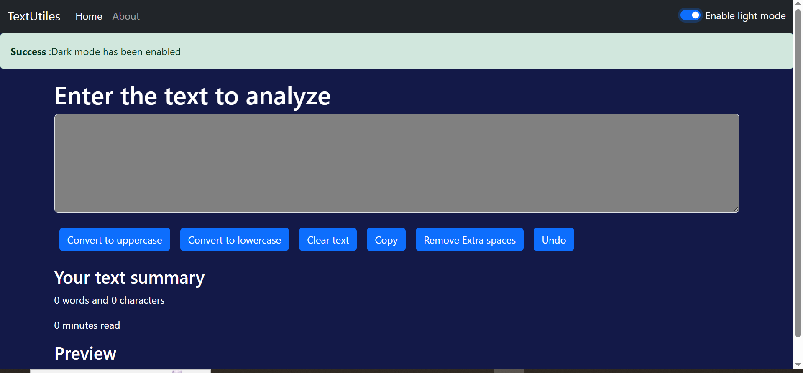

#  TextUtils - React.js App

TextUtils is a simple and user-friendly **React.js** web application that helps users easily transform, analyze, and format text.  
You can convert text to uppercase/lowercase, remove extra spaces, copy text with one click, and even check reading time instantly.

---

# Features

-  Convert text to **Uppercase** and **Lowercase**
-  Remove **extra spaces** automatically
-  Copy text to **clipboard** with one click
-  Get **word count**, **character count**, and **reading time**
-  **Undo** recent changes (works for recent transformations)
-  Supports **Dark / Light mode** for better user experience

---

# Technologies Used

- **React.js** (Frontend Library)
- **HTML5**, **CSS3**, **JavaScript (ES6+)**
- **Bootstrap** for responsive design

---
##  App Previews

###  Light Mode


###  Dark Mode



---

# How to Run Locally

Follow these simple steps:

1. **Clone the repository**
   ```bash
   git clone https://github.com/resma88/TextUtils.git
